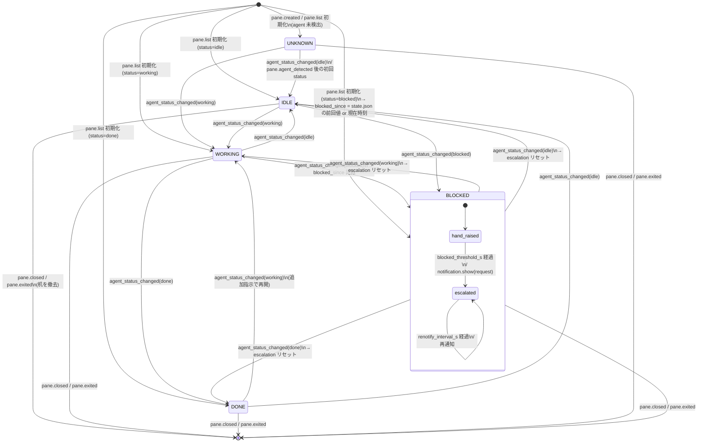

# キャラクター状態遷移とスプライト仕様

Agent Office の机キャラクター（1 机 = 1 herdr ペイン）の視覚状態と遷移の定義。実装は [design.md](design.md) §4–5 の OfficeState / Renderer が担う。

## 1. 視覚状態

herdr の `AgentStatus`（`idle | working | blocked | done | unknown`）を唯一の入力とし、視覚状態はそれに机ライフサイクルを加えた 6 種。

| 視覚状態 | 由来 | 見た目（tier 1） | アニメ（2 FPS） |
|---|---|---|---|
| `EMPTY` | 机はあるがペイン消滅の瞬間 / filter対象外 | 机と消灯モニタのみ | なし |
| `IDLE` | `idle` | 椅子にもたれる。コーヒーカップ | 湯気が 2 フレームで揺れる |
| `WORKING` | `working` | 前傾でキーボードに手。モニタ点灯（緑） | 手が 2 フレームで上下（タイピング） |
| `BLOCKED` | `blocked` | **挙手** + 頭上に吹き出し `!`（state_label があれば先頭 1 語） | 吹き出しが点滅（手は挙げたまま。視認性優先） |
| `DONE` | `done` | 伸び / 頭上にチェックマーク（緑） | チェックがゆっくり明滅 |
| `UNKNOWN` | `unknown`（検出前・検出不能） | 灰色シルエット、モニタ消灯 | なし |

付加オーバーレイ（状態と直交）:
- **FOCUSED**: herdr 上でフォーカス中のペインの机の床を明るくする。
- **SELECTED**: office 内カーソル。机の枠をアクセント色で描く。
- **ESCALATED**: blocked が `blocked_threshold_s` を超えた机。吹き出しが `!`（中立色）→ `!!`（`alert` 赤）になる（トースト送出と同期）。

## 2. 状態遷移図

遷移トリガはすべて herdr イベント（括弧内）。ポーリングはしない。



注:
- 任意の状態間遷移がイベント順序次第で発生し得る（例 idle→done）。実装は**現在値の置換**として扱い、遷移表の網羅チェックはしない（herdr が唯一の真実、design.md §4）。
- BLOCKED 内部のエスカレーションはタイマー駆動（イベントではない）。blocked 解除・机撤去で必ずリセットする。

## 3. スプライト仕様（tier 1）

- 机 1 台 = **16px × 12px**（テキストセルでは 16 桁 × 6 行。1 セルが縦 2px の半ブロック `▀`）。
- 下に 1 行のネームプレート（`display_name` を机幅に切詰め）+ 状態テキスト。
- パレットは意味色を固定し、テーマで色値だけ差し替える:

| 意味 | 既定色 | 用途 |
|---|---|---|
| `floor_a` / `floor_b` | 暗灰 2 種 | 床の市松 |
| `desk` | 木目茶 | 机 |
| `screen_on` / `screen_off` | 緑 / 暗灰 | モニタ |
| `skin` | 肌色 | 頭・手（UNKNOWN では `shirt_unknown` に置換して灰色シルエット化） |
| `shirt_idle` 等 | 状態ごと | 胴体（idle=青, working=緑, blocked=橙, done=紫, unknown=灰） |
| `bubble` / `bubble_text` | 白 / 濃灰 | 吹き出しの地と BLOCKED の `!` |
| `alert` | 赤 | ESCALATED の吹き出し `!!` |
| `accent` | シアン | SELECTED 枠・ヘッダ |

- スプライトはソース内で「文字 = パレットキー」のグリッド定数として保持（画像アセット不要、tier 2 では同グリッドから PNG を生成して `pane.graphics.set` に流用）。
- tier 0（ASCII）は同じ状態集合をスティックフィギュアで表現する。モック `mock/office_mock.py --ascii` 参照。

## 4. モックの実行

```
python3 mock/office_mock.py            # tier 1: 半ブロックピクセルアート（静止、全状態を1机ずつ）
python3 mock/office_mock.py --ascii    # tier 0: ASCII フォールバック
python3 mock/office_mock.py --frame 1  # アニメ 2 フレーム目（挙手点滅・タイピング）
```

静止スプライトのモックであり、イベント購読・herdr 接続は含まない（Stage 1 スコープ）。
